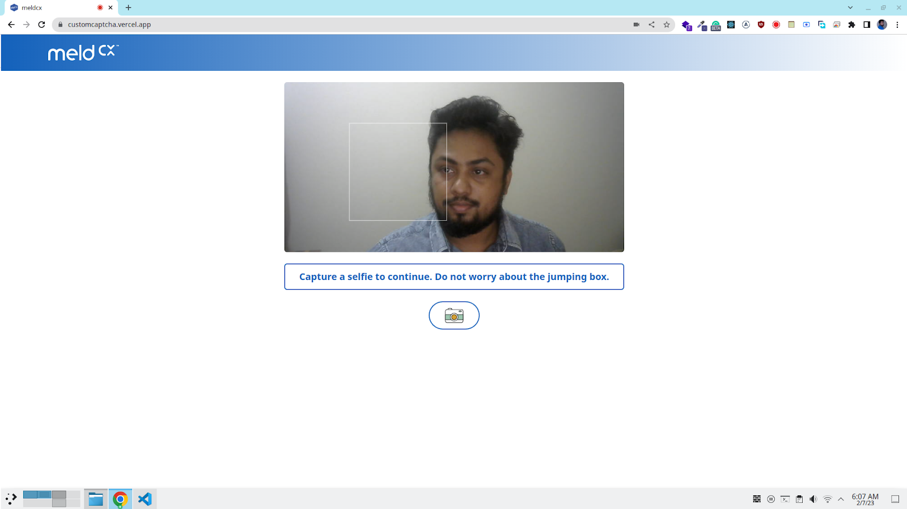
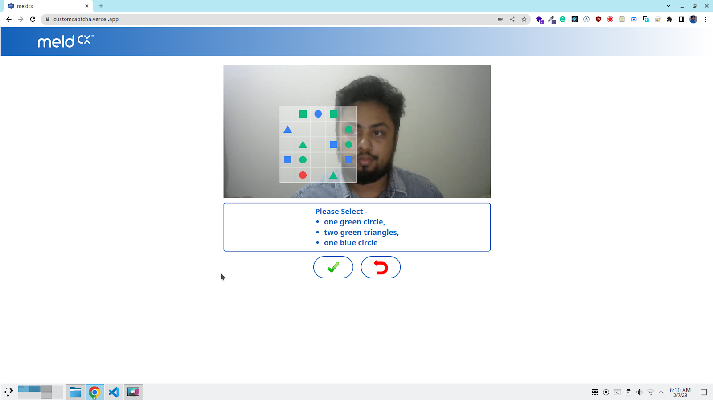
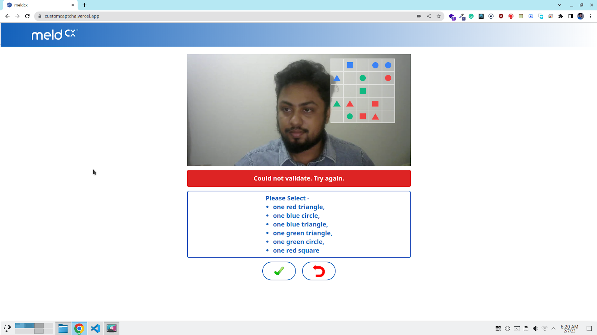
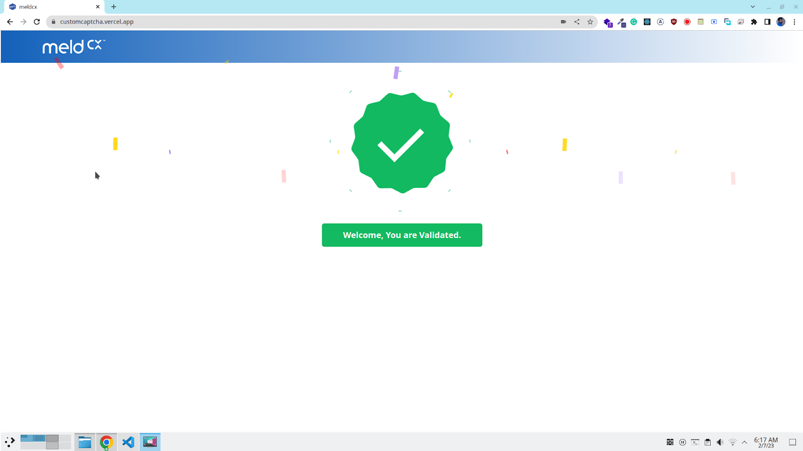
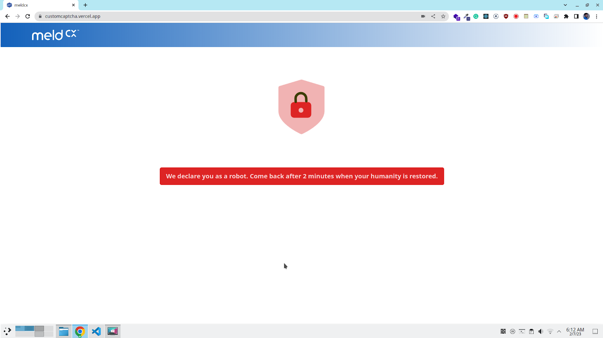

# CustomCaptcha

    

CAPTCHA, an acronym for Completely Automated Public Turing test to tell Computers and Humans Apart, is a commonly used security mechanism that aims to prevent automated systems from accessing protected resources. The goal of this project is to develop a new, user-friendly and interactive form of CAPTCHA that involves capturing a photo of the user.

The CAPTCHA mechanism will prompt the user to capture a selfie using the front-facing camera or webcam. The photo will be processed locally on the client-side and will not be stored. A white square area will move randomly within the viewfinder window and once the picture has been taken, the white box will lock onto the still image. The user will then be asked to identify various shapes and colors displayed within the white box on a 5x5 grid. To pass the CAPTCHA, the user must correctly choose all of the shapes.

This approach provides a more engaging and interactive experience for users compared to traditional text-based or image-based CAPTCHAs.

## Live Demo

Live demo for this project is hosted [here](https://customcaptcha.vercel.app/).

## Development Framework

This is a [Next.js](https://nextjs.org/) project bootstrapped with [`create-next-app`](https://github.com/vercel/next.js/tree/canary/packages/create-next-app).

## Getting Started

After cloning the repo, first install [NEXT.JS](https://nextjs.org/docs/getting-started).

```bash
cp path/to/repo
npm install next react react-dom
```

Install the dependencies with-

```bash
npm install
```

First, run the development server:

```bash
npm run dev
```

Open [http://localhost:3000](http://localhost:3000) with your browser to see the result.

## Validation Flow

The validation flow for the CAPTCHA mechanism will consist of the following key steps:

<p align="center">
  
</p>

1. User Capture: The user will be prompted to capture a photo of themselves using the front-facing camera or webcam.`</p>`

<p align="center">
  
</p>

2. Shape Identification: Once the photo has been taken, the user will be asked to identify various shapes and colors displayed within the white box on a 5x5 grid.

<p align="center">
  
</p>

3. Validation Attempts: The user will be given three chances to correctly identify the shapes and pass the CAPTCHA.

<p align="center">
   
</p>

<p align="center">
   
</p>

4. Result: If the user successfully identifies the shapes within the three attempts, they will be granted access to the protected resource. If the user fails to correctly identify the shapes within the three attempts, they will be blocked for a certain time defined in the .env file.

It is important to note that this validation flow is designed to prevent automated systems from accessing protected resources while providing a user-friendly and interactive experience. The length of the block time can be adjusted based on the specific needs of the implementation.

## .env configurations

```bash
NEXT_PUBLIC_BLOCKTIME = 2 
NEXT_PUBLIC_SQUAREBOXSETINTERVAL = 500 
NEXT_PUBLIC_LENGTHOFFIRSTCHOICE = 4 
NEXT_PUBLIC_LENGTHOFSECONDCHOICE = 6 
NEXT_PUBLIC_LENGTHOFTHIRDCHOICE = 8 
```

The NEXT_PUBLIC_BLOCKTIME value in the .env file determines the length of time that a user will be blocked if they fail to correctly identify the shapes within the three validation attempts. With a value of 2, this means that a user who fails the CAPTCHA will be blocked for 2 minutes. This value can be adjusted based on the specific requirements of the implementation.

The NEXT_PUBLIC_SQUAREBOXSETINTERVAL value in the .env file determines the frequency at which the square-shaped area inside the video stream will change its position. With a value of 500, this means that the square-shaped area will change its position every 500 milliseconds (or 0.5 seconds). This value can be adjusted to determine the speed at which the area moves, and can be used to fine-tune the user experience and make the CAPTCHA more or less challenging.

The NEXT_PUBLIC_LENGTHOFFIRSTCHOICE, NEXT_PUBLIC_LENGTHOFSECONDCHOICE, and NEXT_PUBLIC_LENGTHOFTHIRDCHOICE values in the .env file determine the number of shapes that the user will need to identify in each of the three validation attempts. With a value of 4 for NEXT_PUBLIC_LENGTHOFFIRSTCHOICE, the user will need to correctly identify 4 shapes in their first attempt at the CAPTCHA. If they fail, they will then be given a second attempt with 6 shapes to identify (as determined by NEXT_PUBLIC_LENGTHOFSECONDCHOICE with a value of 6). If they fail again, they will have one final attempt with 8 shapes to identify (as determined by NEXT_PUBLIC_LENGTHOFTHIRDCHOICE with a value of 8). These values can be adjusted to make the CAPTCHA more or less challenging, depending on the specific requirements of the implementation. By increasing the number of shapes to identify in each attempt, the CAPTCHA becomes more difficult and less susceptible to being bypassed by automated systems. Conversely, by decreasing the number of shapes, the CAPTCHA becomes easier and more user-friendly.

## Limitations

1. Device Compatibility: The CAPTCHA mechanism may only work on devices that have a front-facing camera or webcam. This means that users who do not have this hardware may be unable to access the protected resource.
2. User Experience: Some users may find the process of capturing a photo and identifying shapes to be intrusive or time-consuming. The user experience must be carefully considered to ensure that the CAPTCHA mechanism does not negatively impact the overall user experience.
3. Privacy Concerns: While the photo taken by the user will not be stored and will only reside in the client-side, some users may still have concerns about their privacy. It is important to ensure that the privacy policy is clearly communicated to the users and that any privacy-sensitive information is protected.
4. Reliance on Shapes: The CAPTCHA mechanism is reliant on the user's ability to identify shapes and colors. This may not be suitable for users with color blindness or visual impairments. An alternative mechanism may need to be considered to accommodate these users.
5. Limited Attempts: The user only has three chances to pass the CAPTCHA, which may not be enough for some users. This limitation may need to be adjusted based on the specific needs of the implementation.
6. The CAPTCHA mechanism is the lack of automated testing due to time limitations. Automated testing is an important aspect of software development, as it helps to identify and resolve bugs and other issues before the software is released to users. However, due to time limitations, it may not have been possible to implement automated testing for the CAPTCHA mechanism.

## Future Scope

1. The video feed can be analyzed to detect a face. That will make sure the user is a human. Also the facial movement can be detected to identify authenticity of the user.
2. Colors and shapes can be modified for color blind users.
3. Automation tests can be performed to mitigate the edge cases.
